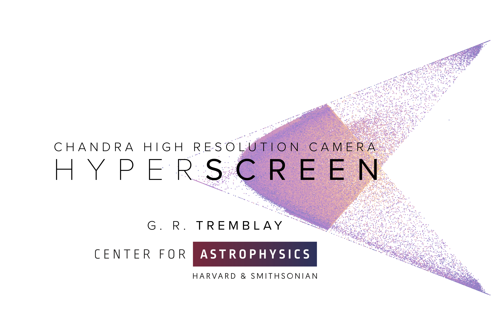

===========
hyperscreen
===========

.. image:: https://img.shields.io/pypi/v/hyperscreen.svg
        :target: https://pypi.python.org/pypi/hyperscreen

.. image:: https://img.shields.io/travis/granttremblay/hyperscreen.svg
        :target: https://travis-ci.com/granttremblay/hyperscreen

.. image:: https://readthedocs.org/projects/hyperscreen/badge/?version=latest
        :target: https://hyperscreen.readthedocs.io/en/latest/?badge=latest
        :alt: Documentation Status

Python Boilerplate contains all the boilerplate you need to create a Python package.

* Free software: MIT license
* Documentation: https://hyperscreen.readthedocs.io.

Features
--------

* TODO

Credits
-------

Grant Tremblay, Ralph Kraft, Paul Nulsen, Dan Patnaude, & Alexey Vikhlinin