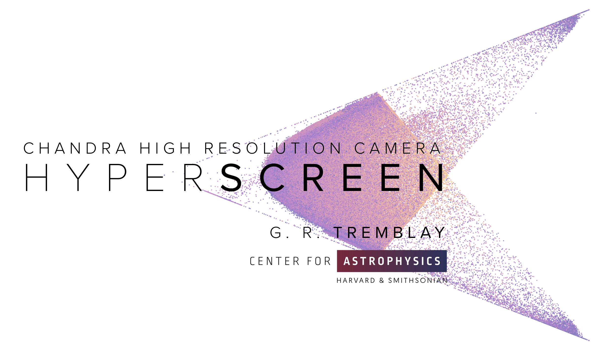

===========
HyperScreen
===========
-----------------------------------------------------------------------
 Improved Background Rejection for the *Chandra* High Resolution Camera
-----------------------------------------------------------------------

.. image:: https://img.shields.io/pypi/v/hyperscreen.svg
        :target: https://pypi.python.org/pypi/hyperscreen

.. image:: https://readthedocs.org/projects/hyperscreen/badge/?version=latest
        :target: https://hyperscreen.readthedocs.io/en/latest/?badge=latest
        :alt: Documentation Status

.. image:: https://img.shields.io/travis/granttremblay/hyperscreen.svg
        :target: https://travis-ci.com/granttremblay/hyperscreen
        :alt: Build Status

.. image:: https://img.shields.io/coveralls/github/granttremblay/hyperscreen
        :target: https://coveralls.io/github/granttremblay/hyperscreen?branch=master
        :alt: Test Coverage
        

.. image:: http://img.shields.io/badge/powered%20by-AstroPy-orange.svg?style=flat
        :target: http://www.astropy.org/
        :alt: Powered by Astropy

.. image:: https://img.shields.io/pypi/l/sphinx_rtd_theme.svg
        :target: https://pypi.python.org/pypi/sphinx_rtd_theme/
        :alt: License

An improved background rejection algorithm for the *Chandra* High Resolution Camera (HRC)

.. toctree::
   :maxdepth: 2
   :caption: Contents:

   readme
   installation
   usage
   authors

Indices and tables
==================

* :ref:`genindex`
* :ref:`modindex`
* :ref:`search`

Features
--------

* HyperScreen dynamically creates a hyperbolic acceptance zone on a *tap-by-tap* basis. 
* TODO

Credits
-------

Grant Tremblay, Ralph Kraft, Paul Nulsen, Dan Patnaude, & Alexey Vikhlinin

* Free software: MIT license

hypercore
=========

.. automodule:: hyperscreen.hypercore
   :members:

archivescreen
=============

.. automodule:: hyperscreen.archivescreen
   :members:

